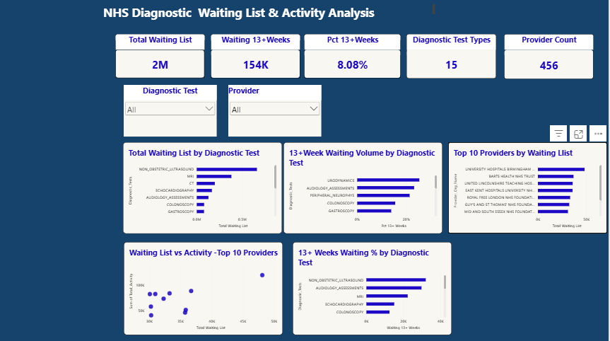

# NHS-Diagnostic-Waiting-List-Analysis

Analysis of NHS diagnostic waiting-list and activity data to identify long waits, diagnostic test patterns, and provider-level variation using SQL Server and Power BI.

## Project Overview

The analysis focuses on understanding the scale of diagnostic waiting lists, identifying long waits of 13+ weeks, comparing diagnostic test categories, and examining variation across providers.
The project follows a structured analytical workflow:

**Data Loading → Profiling → Data Preparation → Data Validation → EDA → Power BI Dashboard**

## Business Questions

The analysis addresses the following business questions:

1. What is the overall scale of the diagnostic waiting list?
2. Which diagnostic tests have the highest waiting-list volumes?
3. Which providers have the largest waiting lists?
4. What proportion of patients are waiting 13+ weeks?
5. Which diagnostic tests contribute the most 13+ week waits?
6. Which diagnostic tests have the highest proportion of their waiting list at 13+ weeks?
7. How does provider waiting-list volume compare with activity?
8. Which providers have the highest waiting-to-activity ratios?
9. Which providers have the highest proportion of their waiting list at 13+ weeks?

## Tools & Technologies

- **SQL Server** — data loading, staging, profiling, data validation, and exploratory data analysis
- **Power BI** — data modelling, DAX measures, interactive visualisation, and dashboard development
- **Power Query** — data preparation and transformation within Power BI
- **GitHub** — project documentation and version control

## Data Workflow

The project follows these stages:
1. **Data Loading** — Created the SQL Server table structure and loaded the source CSV into a staging table.
2. **Data Profiling** — Reviewed reporting periods, providers, commissioners, diagnostic tests, and numeric ranges.
3. **Data Preparation** — Created the analytical dataset from the staging data.
4. **Data Validation** — Checked missing values, whitespace, negative values, duplicate records, completeness, row counts, and numeric ranges.
5. **Exploratory Data Analysis (EDA)** — Used SQL to answer nine business questions related to waiting-list volume, long waits, activity, and provider-level variation.
6. **Power BI Analysis** — Built an interactive dashboard using DAX measures, charts, and slicers.

## Dataset & Scope
The dataset contains NHS diagnostic waiting-list and activity information for a reporting period.

The analysis covers:

- Diagnostic test categories
- Provider organisations
- Commissioner organisations
- Waiting-list volumes
- Waiting times across weekly bands
- 13+ week waiting-list volumes
- Waiting-list activity
- Planned and unscheduled activity
- Total activity

The final analytical dataset contains **146,992 records**, covering **15 diagnostic test categories** and **456 providers**.  

## Key Findings

- The final analytical dataset contains **146,992 records** across **15 diagnostic test categories** and **456 providers**.
- The total waiting list, excluding the `TOTAL` category, is **1,910,025**.
- **154,409** records are in the **13+ week** waiting category, representing **8.08%** of the total waiting list.
- **Non-obstetric ultrasound** has the largest waiting-list volume, followed by **MRI** and **CT**.
- Long-wait pressure varies across diagnostic test categories and providers, highlighting differences between overall waiting-list volume and the proportion of patients waiting 13+ weeks.
- Provider-level analysis also shows variation in the relationship between waiting-list volume and activity.

  ## Power BI Dashboard

The validated dataset was connected to Power BI to create an interactive dashboard.

The dashboard includes:

- Total Waiting List KPI
- Waiting 13+ Weeks KPI
- 13+ Week Waiting Percentage KPI
- Diagnostic Test Types KPI
- Provider Count KPI
- Waiting-list volume by diagnostic test
- 13+ week waiting percentage by diagnostic test
- Top 10 providers by waiting-list volume
- Waiting List vs Activity analysis
- 13+ week waiting volume by diagnostic test
- Diagnostic Test and Provider slicers

  ## SQL Repository Structure
SQL/
├── 01_Database_Setup_and_Data_Load.sql
├── 02_Staging_and_Profiling.sql
├── 03_Data_Preparation.sql
├── 04_Final_Data_Validation.sql
└── 05_EDA_Analysis.sql

## Data Quality & Analytical Notes

Data-quality checks were performed before the exploratory analysis, including checks for:

- Missing organisation information
- Leading or trailing whitespace
- Negative values
- Duplicate record combinations
- Completeness of key analytical fields
- Final row counts
- Numeric ranges

Missing values were investigated rather than automatically replaced. A missing value was not assumed to represent zero without a supporting business rule.

The dataset represents a reporting-period snapshot, so the analysis focuses on the available waiting-list and activity data rather than time-series trends.

## Project Limitations

- The dataset represents a single reporting period, so the project does not analyse trends over time.
- Missing values present in the source data were retained where there was no clear business rule for replacement.
- The `TOTAL` diagnostic-test category was excluded from analytical aggregations to avoid double counting.
- The analysis focuses on descriptive and exploratory insights rather than forecasting or predictive modelling.

  ## Project Outcome

This project demonstrates an end-to-end healthcare data analysis workflow using SQL Server and Power BI.

It combines data loading, profiling, preparation, validation, exploratory analysis, DAX measures, and interactive dashboard development to translate NHS diagnostic waiting-list data into meaningful analytical insights.

## Data Source

The project uses an NHS diagnostic waiting-list and activity dataset for the reporting period **DM01-MAY-2026**.

The dataset contains provider, commissioner, diagnostic test, waiting-list, waiting-time, and activity information used for the analysis.

## Power BI Dashboard Preview

The Power BI dashboard provides an interactive view of diagnostic waiting-list volume, long waits, diagnostic test patterns, and provider-level variation.

### Dashboard

